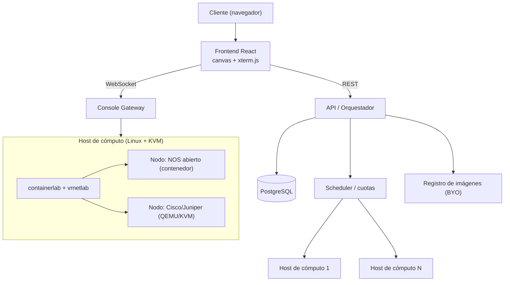

# Plataforma de Laboratorios de Red — Documento de Diseño

**Proyecto:** Plataforma de laboratorios de red (nombre de trabajo: *NetForge*) · **Autor:** BuildWise Labs · **Estado:** Borrador de diseño v0.1 · **Fecha:** 2026

Entorno web multi‑tenant, estilo GNS3/EVE‑NG, para diseñar y ejecutar topologías de red con emuladores de routers, switches y firewalls (NOS abiertos incluidos y Cisco/Juniper vía imagen propia del cliente). Pensado como **producto/servicio para clientes**. Este documento fija el alcance, la arquitectura, el modelo de datos, el aislamiento multi‑tenant y un plan por fases, para decidir el stack antes de escribir código.

---

## 1. Resumen ejecutivo

La plataforma permite a un cliente construir una topología en el navegador (arrastrar nodos, cablear enlaces), desplegarla sobre nuestro cómputo y abrir la consola de cada equipo desde el navegador. El motor de emulación se apoya en **containerlab + vrnetlab** sobre **KVM** en servidores dedicados; no se reinventa el cableado ni el ciclo de vida de los nodos. El valor que se cobra es la **plataforma, el cómputo y el multi‑tenancy**, no las imágenes. Las imágenes comerciales (Cisco/Juniper) siguen un modelo **BYO** (el cliente sube la suya, licenciada). Se arranca con un catálogo de **NOS abiertos** para tener producto vendible pronto y sin bloqueo legal, y las imágenes comerciales entran en una fase posterior.

---

## 2. Objetivo y alcance

### Dentro de alcance
- Editor visual de topologías (canvas web) con persistencia por proyecto.
- Despliegue, arranque, parada y guardado de configuraciones de una topología.
- Consola web (serial/CLI) por nodo.
- Catálogo de NOS abiertos preinstalados.
- Subida de imágenes propias del cliente (BYO) para Cisco/Juniper.
- Multi‑tenancy con aislamiento entre clientes, cuotas y medición de consumo.
- Panel de administración y facturación por consumo (RAM‑hora).

### Fuera de alcance (por ahora)
- Distribuir o revender imágenes comerciales de Cisco/Juniper (ver sección 3).
- Simulación de tráfico a gran escala / generación de carga tipo laboratorio de operador.
- Integración con hardware físico real (passthrough a equipos externos).

---

## 3. Modelo legal de imágenes (decisión clave)

Es el condicionante principal del producto, por eso va antes que la técnica.

- **No** se alojan ni distribuyen imágenes de Cisco IOS/IOS‑XE/NX‑OS ni Juniper Junos a clientes: sus EULAs lo prohíben y las imágenes de Cisco CML/VIRL están atadas a su propia licencia.
- **Modelo adoptado: BYO‑image.** El cliente sube su imagen ya licenciada; nosotros ofrecemos la plataforma y el cómputo. Antes de subir, el cliente acepta una declaración de que posee la licencia (queda registrada).
- **Catálogo abierto incluido**, legalmente redistribuible: VyOS (router/firewall), FRRouting, Nokia SR Linux (gratis), Arista cEOS (gratis con cuenta), y las imágenes de laboratorio de Juniper **vJunos‑router / vJunos‑switch** y **cRPD**.
- **Vía partner** (acuerdo formal con Cisco/Juniper para redistribuir) queda como opción futura, no como dependencia del arranque.

---

## 4. Arquitectura

### Diagrama (Mermaid)



### Diagrama (ASCII)

```text
  Cliente (navegador)
        |
   +----+-----------------------------+
   |  Frontend React (canvas, xterm)  |
   +----+--------------------+--------+
        | REST               | WebSocket
        v                    v
   +---------+          +--------------+
   |   API   |          |   Console    |
   | Orquest.|          |   Gateway    |
   +----+----+          +------+-------+
        | Postgres / Scheduler        |
        v                             v
   +-----------------------------------------+
   |   Host de cómputo (Linux + KVM)         |
   |   containerlab + vrnetlab               |
   |    ├─ nodo NOS abierto (contenedor)     |
   |    └─ nodo Cisco/Juniper (QEMU/KVM)     |
   +-----------------------------------------+
```

### Componentes

- **Frontend (React):** editor de topología (canvas), paleta de nodos, panel de configuración, consola web con xterm.js. Reutiliza el stack web que ya usamos.
- **API / Orquestador:** CRUD de proyectos, despliegue de topologías (invoca containerlab), ciclo de vida (start/stop/save), cuotas y autorización.
- **Scheduler:** ubica cada laboratorio en un host con RAM libre (bin‑packing), aplica cuotas y apaga laboratorios ociosos (*idle reaping*).
- **Motor de emulación:** containerlab (cableado, ciclo de vida) + vrnetlab (empaqueta las VMs Cisco/Juniper como contenedores) sobre Docker y KVM.
- **Console Gateway:** puente WebSocket ↔ consola serial/telnet de cada nodo, con tokens de acceso de corta vida.
- **Registro de imágenes:** almacenamiento aislado para imágenes BYO, con escaneo y control de formato.
- **PostgreSQL:** proyectos, topologías, nodos, enlaces, imágenes, sesiones y auditoría.

---

## 5. Modelo de datos (esquema inicial)

```sql
-- Organizaciones/clientes y usuarios
tenants(id, nombre, plan, cuota_ram_mb, cuota_nodos, cuota_labs, creado_en)
users(id, tenant_id, email, rol, creado_en)

-- Proyectos = topologías
labs(id, tenant_id, nombre, topologia_json, estado, host_id, creado_en)
nodes(id, lab_id, nombre, tipo, imagen_id, vcpu, ram_mb, startup_config)
links(id, lab_id, a_node, a_port, b_node, b_port)

-- Catálogo e imágenes BYO
images(id, tenant_id, vendor, os, version, formato, storage_ref,
       licencia_aceptada, estado_escaneo, publica, creado_en)

-- Cómputo, consumo y auditoría
hosts(id, hostname, ram_total_mb, ram_usada_mb, estado)
runs(id, lab_id, host_id, iniciado_en, detenido_en, ram_horas)
audit_log(id, tenant_id, user_id, accion, objeto, ts)
```

`topologia_json` guarda posiciones y estilo del canvas; `nodes`/`links` son la fuente de verdad para desplegar. `images.publica` distingue el catálogo abierto de las imágenes BYO privadas de cada tenant.

---

## 6. Red y plano de datos

- Cada laboratorio se despliega como una **topología de containerlab aislada**, con su propio contexto de red (namespaces).
- **Enlaces:** entre contenedores, pares `veth`; para nodos QEMU (Cisco/Juniper) vía interfaces `tap` puenteadas. containerlab lo genera a partir de `nodes`/`links`.
- **Red de gestión** por laboratorio, separada del plano de datos.
- **Sin L2/L3 compartido entre laboratorios** de distintos tenants: bridges y namespaces separados.
- **Egress a internet denegado por defecto**; si un escenario lo requiere, se habilita con un nodo NAT y política de salida explícita.

---

## 7. Multi‑tenancy, aislamiento y seguridad

- **Aislamiento entre tenants:** namespaces y bridges separados; ningún laboratorio puede alcanzar el de otro cliente.
- **Imágenes BYO = binarios no confiables:** se guardan en un registro aislado, se escanean (formato/malware) y se ejecutan como QEMU sin privilegios (seccomp/AppArmor), sin acceso al host.
- **Acceso a consola:** tokens firmados de corta vida, con alcance a un `lab`+`node` concretos; el Console Gateway valida en cada conexión.
- **Egress controlado:** por defecto los laboratorios no salen a internet.
- **Secretos** (credenciales de host, licencias) en un gestor de secretos, nunca en el repositorio.
- **Auditoría** de cada acción relevante (despliegue, parada, subida de imagen, acceso a consola).

---

## 8. Escalado, capacidad y costos

La **RAM es el recurso que manda.** Consumo típico por nodo:

- NOS en contenedor (VyOS, FRR, SR Linux, cRPD): ~0.1–0.5 GB.
- Cisco IOSv: ~1 GB. Juniper vSRX/vMX: ~4–8 GB.

Ejemplo: un host dedicado de **128 GB** (menos ~16 GB de sistema) da para **~14 nodos de 8 GB** o **cientos** de nodos en contenedor. Consecuencias de diseño:

- **Bin‑packing** por RAM libre al ubicar un laboratorio.
- **Idle reaping**: suspender/parar laboratorios ociosos tras N minutos (si no, la factura de RAM se dispara).
- **Cuotas por plan**: nodos máximos, RAM máxima, laboratorios concurrentes.
- **Facturación por RAM‑hora** medida en `runs`.
- **Infra recomendada:** servidores dedicados (p. ej. Hetzner/OVH), del orden de €100–250/mes por host de RAM alta (verificar precios actuales). La nube con virtualización anidada funciona pero sale cara para cargas con muchas VMs.

---

## 9. Catálogo de NOS

### Abiertos (incluidos, redistribuibles)
- **VyOS** — router y firewall.
- **FRRouting** — routing (BGP/OSPF/IS‑IS).
- **Nokia SR Linux** — gratis.
- **Arista cEOS** — gratis con cuenta.
- **Juniper vJunos‑router / vJunos‑switch / cRPD** — imágenes de laboratorio de Juniper.

### Comerciales (solo BYO)
- **Cisco** IOSv / IOS‑XRv / NX‑OSv / CSR/Cat8000v — el cliente sube su imagen licenciada.
- **Juniper** vMX / vSRX / vQFX — ídem.
- **Firewalls** Palo Alto / Fortinet — ídem, según disponibilidad de imagen del cliente.

---

## 10. Stack propuesto

- **Frontend:** React + librería de canvas (p. ej. React Flow) + xterm.js.
- **API / Orquestador:** FastAPI (Python) o Node; invoca containerlab y consulta Postgres.
- **Motor:** containerlab + vrnetlab, Docker, KVM/libvirt.
- **Console Gateway:** servicio WebSocket ligero (Python `websockets` o Node `ws`).
- **Base de datos:** PostgreSQL (ya en uso en el backend actual).
- **Infra:** Linux bare‑metal con KVM; Docker; almacenamiento para imágenes.

---

## 11. Roadmap por fases

### Fase 1 — MVP de plataforma (NOS abiertos)
- Canvas de topología, persistencia de proyectos, despliegue con containerlab.
- Consola web (xterm.js + Console Gateway).
- Catálogo abierto (VyOS/FRR/SR Linux).
- Un host de cómputo, un tenant de prueba.
- **Entregable:** laboratorios de red funcionando en el navegador, ya demostrable/vendible.

### Fase 2 — Imágenes comerciales (BYO) y motor QEMU
- Pipeline de subida BYO: aceptación de licencia, escaneo, registro aislado.
- Integración vrnetlab para Cisco/Juniper.
- **Entregable:** el cliente corre su Cisco/Juniper licenciado.

### Fase 3 — Producto multi‑tenant
- Aislamiento entre tenants, cuotas, scheduler multi‑host, idle reaping.
- Planes, medición por RAM‑hora y facturación.
- Panel de administración.
- **Entregable:** servicio comercial con clientes de pago.

---

## 12. Riesgos y mitigaciones

- **Licencias (alto):** distribuir imágenes comerciales sería infracción → modelo BYO + catálogo abierto; declaración de licencia registrada.
- **Costo de RAM (alto):** cargas con VMs son caras → priorizar NOS en contenedor, idle reaping, cuotas y precio por RAM‑hora.
- **Aislamiento multi‑tenant (alto):** una fuga entre clientes sería crítica → namespaces/bridges separados, egress denegado por defecto, auditoría.
- **Imágenes subidas no confiables (medio):** escaneo, QEMU sin privilegios, sin acceso al host.
- **Rendimiento de QEMU (medio):** requiere KVM real (bare‑metal o virtualización anidada), no hosting compartido.

---

## 13. Preguntas abiertas / próximas decisiones

- Nombre y marca del producto.
- API en **FastAPI** vs **Node** (afinidad con el resto del stack).
- Proveedor de infra concreto y tamaño del primer host.
- Modelo de precios detallado (planes, RAM‑hora, límites).
- Alcance exacto del catálogo abierto en la Fase 1.
