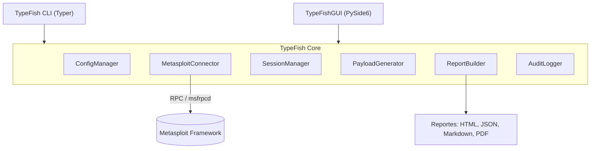

# TypeFish Suite — Documentación Oficial

**Versión:** 1.0.0 · **Autor:** BuildWise Labs · **Fecha:** 2026 · **Licencia:** MIT · **Python:** 3.10+ · **Build:** passing

**TypeFish Suite** es un conjunto de dos herramientas complementarias que orquestan pruebas de penetración **autorizadas** sobre Metasploit Framework: **TypeFish** (CLI) para trabajo en terminal, scripting y CI/CD, y **TypeFishGUI** (interfaz gráfica) para operación visual y revisión de resultados. Ambas comparten un mismo motor (*TypeFish Core*), de modo que un escaneo, un perfil o un reporte generado en una funciona igual en la otra. El objetivo es reducir el trabajo manual y repetitivo de una evaluación —enumeración, selección de módulos, ejecución controlada y reporte— manteniendo trazabilidad y control del alcance en todo momento.

---

## ⚠️ Aviso legal y ético

**TypeFish Suite es una herramienta para pruebas de seguridad autorizadas.** Úsala únicamente sobre sistemas de tu propiedad o para los que tengas **autorización escrita y explícita**: contrato de pentesting, alcance definido, laboratorio propio o competencia CTF. El acceso o la explotación de sistemas sin permiso es ilegal en la mayoría de las jurisdicciones. El autor y BuildWise Labs no se hacen responsables del mal uso. Antes de cualquier ejecución, define el alcance en un archivo de *scope* y activa el registro de auditoría.

---

## Contenido

1. Introducción
2. Requisitos e instalación
3. Arquitectura técnica
4. Configuración y perfiles
5. Uso de la CLI (TypeFish)
6. Uso de la GUI (TypeFishGUI)
7. Reportes
8. Buenas prácticas y seguridad operativa

---

## 1. Introducción

TypeFish Suite resuelve un problema común en evaluaciones de seguridad autorizadas: el flujo de trabajo con Metasploit es potente pero manual y repetitivo. La suite lo ordena en dos frentes que comparten el mismo núcleo.

**TypeFish (CLI)** está pensada para terminal, scripting y automatización. Es ideal para pipelines de CI/CD, laboratorios y operadores avanzados; entrega texto, JSON y *exit codes*, y el modo headless es nativo.

**TypeFishGUI (interfaz gráfica)** está pensada para operación visual y revisión de hallazgos. Es ideal para sesiones interactivas, informes y trabajo en equipo; muestra paneles, tablas y gráficas, y también ofrece un modo headless (`--headless`) para automatización.

### ¿Cuándo usar cada una?

- Usa la **CLI** cuando quieras reproducibilidad, integrarla en un pipeline o trabajar por SSH.
- Usa la **GUI** para explorar resultados, coordinar un equipo o preparar el reporte final.
- Como comparten *TypeFish Core*, puedes empezar un escaneo en la CLI y continuar la revisión en la GUI.

### Casos de uso legítimos

- Pentesting bajo contrato con alcance autorizado.
- Ejercicios de *red team* autorizados.
- Laboratorios de práctica (HTB, TryHackMe, VulnHub).
- Competencias CTF y formación en seguridad.

---

## 2. Requisitos e instalación

### Requisitos

- **Software:** Python 3.10+, Metasploit Framework 6.x, PostgreSQL (lo usa Metasploit).
- **Hardware:** 4 GB de RAM mínimo (8 GB recomendado), 2 vCPU.
- **Sistemas soportados:** Linux (recomendado, p. ej. Kali/Debian/Ubuntu), Windows 10/11 y macOS.

### Dependencias de Python

```text
pymetasploit3>=1.0
typer>=0.12
pydantic>=2.0
pyyaml>=6.0
rich>=13.0
jinja2>=3.1        # reportes HTML/Markdown
PySide6>=6.6       # solo TypeFishGUI
```

### Iniciar el servicio RPC de Metasploit

TypeFish se comunica con Metasploit por su interfaz RPC (`msfrpcd`). Metasploit ya viene en Kali; en otras distros sigue el instalador oficial.

```bash
# Inicia el demonio RPC de Metasploit (elige un password propio)
msfrpcd -P TU_PASSWORD_RPC -S -a 127.0.0.1 -p 55553
```

### Instalar TypeFish (CLI)

```bash
pip install typefish
# o desde el repositorio
git clone https://github.com/buildwiselabs/typefish.git
cd typefish && pip install -e .
```

### Instalar TypeFishGUI

```bash
pipx install typefish-gui   # recomendado, entorno aislado
# o
pip install typefish-gui
```

### Configuración inicial

Define las variables de conexión al RPC (o guárdalas en el perfil, ver la sección 4):

```bash
export TYPEFISH_MSF_HOST=127.0.0.1
export TYPEFISH_MSF_PORT=55553
export TYPEFISH_MSF_PASSWORD=TU_PASSWORD_RPC
```

### Verificar la instalación

```bash
typefish --version
typefish-gui --version
typefish doctor      # comprueba Python, el RPC de Metasploit y las dependencias
```

### Docker (opcional)

```bash
docker run --rm -it buildwiselabs/typefish:1.0.0 typefish --version
```

---

## 3. Arquitectura técnica

TypeFish separa el **motor compartido** (Core) de las dos capas de presentación (CLI y GUI). Todo lo que toca a Metasploit pasa por un único conector, y todas las acciones quedan registradas para auditoría.

### Diagrama (Mermaid)



### Diagrama (ASCII)

```text
  [ TypeFish CLI ]        [ TypeFishGUI ]
         \                    /
          v                  v
     +---------------------------+
     |      TypeFish Core        |
     |  ConfigManager            |
     |  MetasploitConnector -----+---> (RPC) ---> Metasploit Framework
     |  SessionManager           |
     |  PayloadGenerator         |
     |  ReportBuilder ----+      |
     |  AuditLogger       |      |
     +--------------------|------+
                          v
              HTML · JSON · Markdown · PDF
```

### Componentes

- **TypeFish Core** — motor compartido; expone la lógica que consumen CLI y GUI.
- **TypeFish CLI** — capa de comandos (Typer): traduce argumentos a llamadas del Core.
- **TypeFishGUI** — capa visual (PySide6): paneles, tablas y edición de perfiles.
- **MetasploitConnector** — único punto de comunicación con Metasploit vía RPC.
- **SessionManager** — registra y consulta las sesiones abiertas durante la evaluación.
- **PayloadGenerator** — *wrapper* de `msfvenom` para generar artefactos de prueba autorizados.
- **ReportBuilder** — consolida hallazgos y evidencias en el formato elegido.
- **ConfigManager** — carga y valida perfiles YAML/JSON; compartido por CLI y GUI.
- **AuditLogger** — registro detallado y con marca de tiempo de cada acción.

### Estructura de directorios (monorepo)

```text
typefish-suite/
├── packages/
│   ├── typefish-core/        # motor compartido
│   │   └── typefish_core/
│   │       ├── connector.py      # MetasploitConnector (RPC)
│   │       ├── sessions.py       # SessionManager
│   │       ├── payloads.py       # PayloadGenerator (wrapper msfvenom)
│   │       ├── reporting.py      # ReportBuilder
│   │       ├── config.py         # ConfigManager
│   │       └── audit.py          # AuditLogger
│   ├── typefish-cli/         # TypeFish (Typer)
│   └── typefish-gui/         # TypeFishGUI (PySide6)
├── profiles/                 # perfiles de escenario (YAML/JSON)
├── reports/                  # salidas generadas
├── docs/
└── requirements.txt
```

---

## 4. Configuración y perfiles

Un **perfil** define un escenario de trabajo (objetivos dentro del alcance, formato de reporte, nivel de log) y lo comparten CLI y GUI. Así una evaluación es reproducible y queda documentada.

```yaml
# profiles/laboratorio.yml
name: laboratorio-interno
metasploit:
  host: 127.0.0.1
  port: 55553
scope:                 # SOLO objetivos autorizados
  allow:
    - 10.10.10.0/24
  deny:
    - 10.10.10.1       # gateway, fuera de alcance
safe_check: true       # validar sin explotar por defecto
report:
  format: html
  output: reports/
audit:
  level: verbose
  file: reports/audit.log
```

- **`scope.allow` / `scope.deny`** delimitan los objetivos permitidos; TypeFish rechaza cualquier acción fuera del alcance.
- **`safe_check`** deja el modo de validación como predeterminado (ver la sección 5).
- **`audit`** activa el registro de auditoría de todas las acciones.

Sincronización entre herramientas: `typefish config sync` deja el mismo perfil disponible para TypeFishGUI (y al revés desde la GUI).

---

## 5. Uso de la CLI (TypeFish)

Superficie de comandos principal (cada uno acepta `--help`):

```bash
# Enumeración de un objetivo dentro del alcance
typefish scan --profile laboratorio --target 10.10.10.5

# Búsqueda de módulos de Metasploit por servicio o CVE
typefish search --service smb
typefish search --cve CVE-2017-0144

# Validación de vulnerabilidad SIN explotar (recomendado como primer paso)
typefish check --profile laboratorio --target 10.10.10.5 --module <módulo>

# Gestión de sesiones abiertas durante la evaluación
typefish session list
typefish session info <id>

# Generar el reporte de la evaluación
typefish report --profile laboratorio --format html
```

### Modo *safe check*

`typefish check` consulta el estado de una vulnerabilidad usando las comprobaciones no intrusivas del módulo de Metasploit, sin lanzar el exploit. Es la forma recomendada de confirmar exposición antes de decidir cualquier acción posterior dentro de un alcance autorizado.

### Post-explotación

En una sesión ya establecida sobre un objetivo autorizado, TypeFish expone las capacidades de post-explotación del propio Metasploit (recolección de evidencias, `hashdump`, comprobaciones de persistencia) para documentarlas en el reporte. Estas acciones solo deben ejecutarse dentro del alcance contratado y quedan registradas por el `AuditLogger`.

---

## 6. Uso de la GUI (TypeFishGUI)

TypeFishGUI presenta el mismo flujo del Core en paneles: **Objetivos**, **Módulos**, **Sesiones** y **Reporte**. Carga un perfil, muestra el alcance activo de forma visible y permite revisar hallazgos y evidencias antes de exportar.

```bash
typefish-gui                       # interfaz gráfica
typefish-gui --profile laboratorio # abre con un perfil

# Modo headless para CI/CD
typefish-gui --headless --profile laboratorio --report html
```

El **modo headless** ejecuta el flujo de un perfil sin ventana, útil para integrarlo en un pipeline y adjuntar el reporte como artefacto.

---

## 7. Reportes

`ReportBuilder` consolida objetivos, hallazgos, sesiones y línea de tiempo de auditoría en el formato elegido:

- **HTML** — informe navegable para entregar al cliente.
- **Markdown** — para repositorios y wikis.
- **JSON** — para procesar los resultados en otras herramientas.
- **PDF** — versión imprimible del informe HTML.

```bash
typefish report --profile laboratorio --format html --output reports/
```

Cada reporte incluye el alcance autorizado, la marca de tiempo de cada acción y las evidencias recogidas, de modo que la evaluación sea auditable.

---

## 8. Buenas prácticas y seguridad operativa

- Trabaja siempre con un **perfil con `scope` definido**; nunca ejecutes contra objetivos fuera del alcance autorizado.
- Empieza por **`typefish check`** (safe check) antes de considerar cualquier acción intrusiva.
- Mantén el **`AuditLogger` en `verbose`** durante los engagements para tener trazabilidad completa.
- Guarda las credenciales del RPC en variables de entorno o en un gestor de secretos, **nunca** en el repositorio.
- Restringe `msfrpcd` a `127.0.0.1` salvo que necesites acceso remoto controlado.
- Conserva el archivo de autorización (alcance firmado) junto al reporte de cada evaluación.
